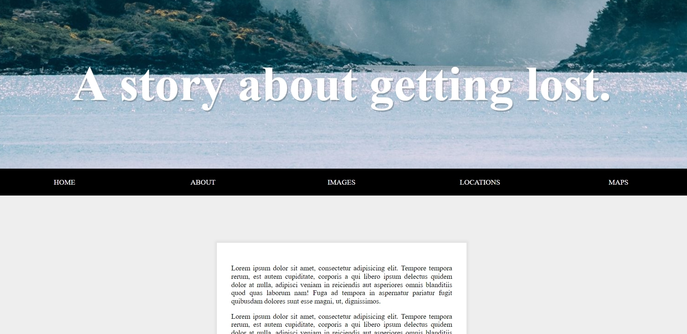
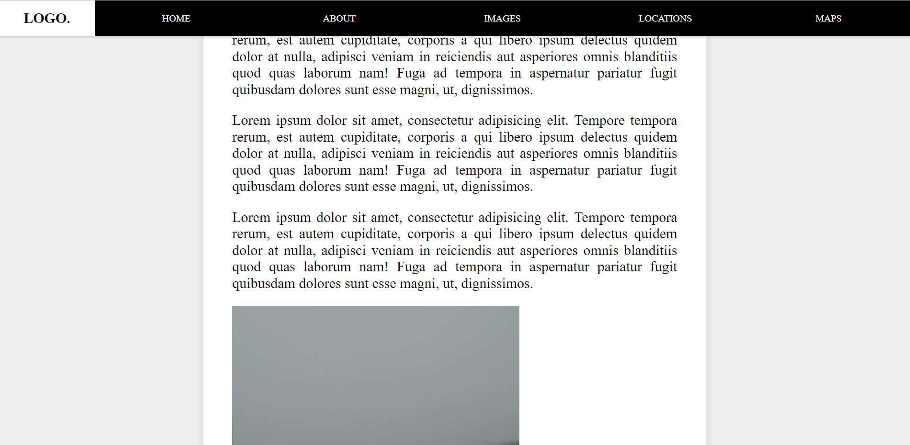

# Sticky Nav



Download or clone repository and click the index.html file to run.

Navigation bar was fixed to the top of the browser when it reaches the top of the browser when scrolling at this point the logo comes in from the left and is visible.



### Get the position of nav

get nav's top position related to the top of window

```
const nav = document.querySelector('#main');
const topOfNav = nav.offsetTop;  // 320
```

### The `fixNav()` function

```
function fixNav() {
  if (window.scrollY >= topOfNav) {
    document.body.style.paddingTop = nav.offsetHeight + 'px';  // 77px (nav's height)
    document.body.classList.add('fixed-nav');
  } else {
    document.body.style.paddingTop = 0;
    document.body.classList.remove('fixed-nav');
  }
}

window.addEventListener('scroll', fixNav);
```

